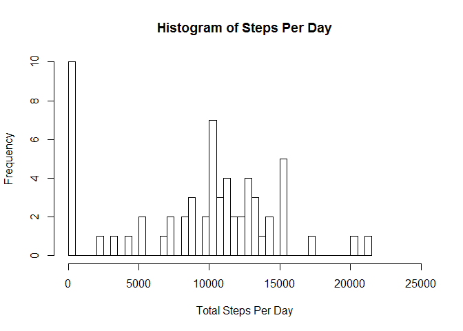
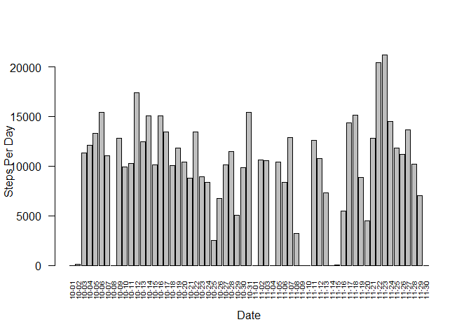
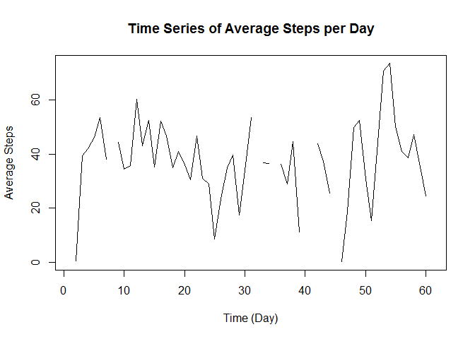
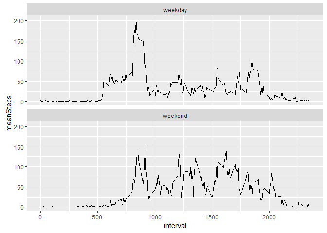

Assignment Description
----------------------

The data used for this project contains personal movement data that was
gathered using activity monitoring devices such as a Fitbit, Nike
Fuelband, or Jawbone Up.

This assignment makes use of data from a personal activity monitoring
device. This device collects data at 5 minute intervals through out the
day. The data consists of two months of data from an anonymous
individual collected during the months of October and November, 2012 and
include the number of steps taken in 5 minute intervals each day.

### Following are the objectives for this assignment:

1.  Load the data set contained in activity.csv
2.  Provide the code for reading in the dataset and/or processing the
    data
3.  Create a Histogram of the total number of steps taken each day
4.  Provide the Mean and median number of steps taken each day
5.  Provide a Time series plot of the average number of steps taken
6.  Show the 5-minute interval that, on average, contains the maximum
    number of steps
7.  Provide the code to describe and show a strategy for inputing
    missing data
8.  Provide a Histogram of the total number of steps taken each day
    after missing values are imputed
9.  Provide a Panel plot comparing the average number of steps taken per
    5-minute interval across weekdays and weekends
10. Include all of the R code needed to reproduce the results (numbers,
    plots, etc.) in the report

### Load the libraries used to generate this report

    ## 
    ## Attaching package: 'dplyr'

    ## The following objects are masked from 'package:stats':
    ## 
    ##     filter, lag

    ## The following objects are masked from 'package:base':
    ## 
    ##     intersect, setdiff, setequal, union

    ## 
    ## Attaching package: 'lubridate'

    ## The following object is masked from 'package:base':
    ## 
    ##     date

    ## Warning: package 'timeDate' was built under R version 3.3.2

### Load the data set contained in activity.csv (1 and 2)

-   Set the file name
-   Use read.table to load the file into activityDT
-   Show the summary of activityDT

<!-- -->

    fileName        <- "D:\\Coursera\\ReproducibleResearch\\activity.csv"
    activityDT      <- read.table(file=fileName, header=TRUE, sep=",")
    summary(activityDT)

    ##      steps                date          interval     
    ##  Min.   :  0.00   2012-10-01:  288   Min.   :   0.0  
    ##  1st Qu.:  0.00   2012-10-02:  288   1st Qu.: 588.8  
    ##  Median :  0.00   2012-10-03:  288   Median :1177.5  
    ##  Mean   : 37.38   2012-10-04:  288   Mean   :1177.5  
    ##  3rd Qu.: 12.00   2012-10-05:  288   3rd Qu.:1766.2  
    ##  Max.   :806.00   2012-10-06:  288   Max.   :2355.0  
    ##  NA's   :2304     (Other)   :15840

### Create a histogram of total steps per day (3)

-   Group by the day using dplyr
-   Now sum the steps per day and remove any NAs
-   Provide a summary of the data grouped by date
-   Create the histogram by frequency
-   Create a barplot by date

<!-- -->

    byDate      <- group_by(activityDT,date)
    stepByDate  <- summarize(byDate, totalSteps=sum(steps, na.rm=TRUE))
    summary(stepByDate)

    ##          date      totalSteps   
    ##  2012-10-01: 1   Min.   :    0  
    ##  2012-10-02: 1   1st Qu.: 6778  
    ##  2012-10-03: 1   Median :10395  
    ##  2012-10-04: 1   Mean   : 9354  
    ##  2012-10-05: 1   3rd Qu.:12811  
    ##  2012-10-06: 1   Max.   :21194  
    ##  (Other)   :55

    # Create a histogram
    hist(stepByDate$totalSteps
        ,breaks=61
        ,xlab="Total Steps Per Day"
        ,ylab="Frequency"
        ,main="Histogram of Steps Per Day"
        ,xlim=c(0,25000))

    # Now create the barplot
    attach(stepByDate)
    barplot(height=totalSteps,xlab="Date",ylab="Steps Per Day",names.arg=format(as.Date(date),"%m-%d"),las=2,cex.names =.60)

### Provide the Mean and median number of steps taken each day (4)

-   Group by the day using dplyr
-   Get the mean and median of the steps per day while removing any NAs
-   Output the mean and median by date
    -   meanSteps is the mean with 0s included
    -   medianSteps1 is the median with 0s included
    -   medianSteps2 is the median with 0s excluded

<!-- -->

    byDateInt       <- group_by(activityDT,date)
    stepByDateInt   <- summarize(byDateInt
                       ,meanSteps=mean(steps, na.rm=TRUE)
                       ,medianSteps1=median(steps, na.rm=TRUE)
                       ,medianSteps2=median(steps[steps>0], na.rm=TRUE))
    kable(stepByDateInt, format = "markdown")

<table>
<thead>
<tr class="header">
<th align="left">date</th>
<th align="right">meanSteps</th>
<th align="right">medianSteps1</th>
<th align="right">medianSteps2</th>
</tr>
</thead>
<tbody>
<tr class="odd">
<td align="left">2012-10-01</td>
<td align="right">NaN</td>
<td align="right">NA</td>
<td align="right">NA</td>
</tr>
<tr class="even">
<td align="left">2012-10-02</td>
<td align="right">0.4375000</td>
<td align="right">0</td>
<td align="right">63.0</td>
</tr>
<tr class="odd">
<td align="left">2012-10-03</td>
<td align="right">39.4166667</td>
<td align="right">0</td>
<td align="right">61.0</td>
</tr>
<tr class="even">
<td align="left">2012-10-04</td>
<td align="right">42.0694444</td>
<td align="right">0</td>
<td align="right">56.5</td>
</tr>
<tr class="odd">
<td align="left">2012-10-05</td>
<td align="right">46.1597222</td>
<td align="right">0</td>
<td align="right">66.0</td>
</tr>
<tr class="even">
<td align="left">2012-10-06</td>
<td align="right">53.5416667</td>
<td align="right">0</td>
<td align="right">67.0</td>
</tr>
<tr class="odd">
<td align="left">2012-10-07</td>
<td align="right">38.2465278</td>
<td align="right">0</td>
<td align="right">52.5</td>
</tr>
<tr class="even">
<td align="left">2012-10-08</td>
<td align="right">NaN</td>
<td align="right">NA</td>
<td align="right">NA</td>
</tr>
<tr class="odd">
<td align="left">2012-10-09</td>
<td align="right">44.4826389</td>
<td align="right">0</td>
<td align="right">48.0</td>
</tr>
<tr class="even">
<td align="left">2012-10-10</td>
<td align="right">34.3750000</td>
<td align="right">0</td>
<td align="right">56.5</td>
</tr>
<tr class="odd">
<td align="left">2012-10-11</td>
<td align="right">35.7777778</td>
<td align="right">0</td>
<td align="right">35.0</td>
</tr>
<tr class="even">
<td align="left">2012-10-12</td>
<td align="right">60.3541667</td>
<td align="right">0</td>
<td align="right">46.0</td>
</tr>
<tr class="odd">
<td align="left">2012-10-13</td>
<td align="right">43.1458333</td>
<td align="right">0</td>
<td align="right">45.5</td>
</tr>
<tr class="even">
<td align="left">2012-10-14</td>
<td align="right">52.4236111</td>
<td align="right">0</td>
<td align="right">60.5</td>
</tr>
<tr class="odd">
<td align="left">2012-10-15</td>
<td align="right">35.2048611</td>
<td align="right">0</td>
<td align="right">54.0</td>
</tr>
<tr class="even">
<td align="left">2012-10-16</td>
<td align="right">52.3750000</td>
<td align="right">0</td>
<td align="right">64.0</td>
</tr>
<tr class="odd">
<td align="left">2012-10-17</td>
<td align="right">46.7083333</td>
<td align="right">0</td>
<td align="right">61.5</td>
</tr>
<tr class="even">
<td align="left">2012-10-18</td>
<td align="right">34.9166667</td>
<td align="right">0</td>
<td align="right">52.5</td>
</tr>
<tr class="odd">
<td align="left">2012-10-19</td>
<td align="right">41.0729167</td>
<td align="right">0</td>
<td align="right">74.0</td>
</tr>
<tr class="even">
<td align="left">2012-10-20</td>
<td align="right">36.0937500</td>
<td align="right">0</td>
<td align="right">49.0</td>
</tr>
<tr class="odd">
<td align="left">2012-10-21</td>
<td align="right">30.6284722</td>
<td align="right">0</td>
<td align="right">48.0</td>
</tr>
<tr class="even">
<td align="left">2012-10-22</td>
<td align="right">46.7361111</td>
<td align="right">0</td>
<td align="right">52.0</td>
</tr>
<tr class="odd">
<td align="left">2012-10-23</td>
<td align="right">30.9652778</td>
<td align="right">0</td>
<td align="right">56.0</td>
</tr>
<tr class="even">
<td align="left">2012-10-24</td>
<td align="right">29.0104167</td>
<td align="right">0</td>
<td align="right">51.5</td>
</tr>
<tr class="odd">
<td align="left">2012-10-25</td>
<td align="right">8.6527778</td>
<td align="right">0</td>
<td align="right">35.0</td>
</tr>
<tr class="even">
<td align="left">2012-10-26</td>
<td align="right">23.5347222</td>
<td align="right">0</td>
<td align="right">36.5</td>
</tr>
<tr class="odd">
<td align="left">2012-10-27</td>
<td align="right">35.1354167</td>
<td align="right">0</td>
<td align="right">72.0</td>
</tr>
<tr class="even">
<td align="left">2012-10-28</td>
<td align="right">39.7847222</td>
<td align="right">0</td>
<td align="right">61.0</td>
</tr>
<tr class="odd">
<td align="left">2012-10-29</td>
<td align="right">17.4236111</td>
<td align="right">0</td>
<td align="right">54.5</td>
</tr>
<tr class="even">
<td align="left">2012-10-30</td>
<td align="right">34.0937500</td>
<td align="right">0</td>
<td align="right">40.0</td>
</tr>
<tr class="odd">
<td align="left">2012-10-31</td>
<td align="right">53.5208333</td>
<td align="right">0</td>
<td align="right">83.5</td>
</tr>
<tr class="even">
<td align="left">2012-11-01</td>
<td align="right">NaN</td>
<td align="right">NA</td>
<td align="right">NA</td>
</tr>
<tr class="odd">
<td align="left">2012-11-02</td>
<td align="right">36.8055556</td>
<td align="right">0</td>
<td align="right">55.5</td>
</tr>
<tr class="even">
<td align="left">2012-11-03</td>
<td align="right">36.7048611</td>
<td align="right">0</td>
<td align="right">59.0</td>
</tr>
<tr class="odd">
<td align="left">2012-11-04</td>
<td align="right">NaN</td>
<td align="right">NA</td>
<td align="right">NA</td>
</tr>
<tr class="even">
<td align="left">2012-11-05</td>
<td align="right">36.2465278</td>
<td align="right">0</td>
<td align="right">66.0</td>
</tr>
<tr class="odd">
<td align="left">2012-11-06</td>
<td align="right">28.9375000</td>
<td align="right">0</td>
<td align="right">52.0</td>
</tr>
<tr class="even">
<td align="left">2012-11-07</td>
<td align="right">44.7326389</td>
<td align="right">0</td>
<td align="right">58.0</td>
</tr>
<tr class="odd">
<td align="left">2012-11-08</td>
<td align="right">11.1770833</td>
<td align="right">0</td>
<td align="right">42.5</td>
</tr>
<tr class="even">
<td align="left">2012-11-09</td>
<td align="right">NaN</td>
<td align="right">NA</td>
<td align="right">NA</td>
</tr>
<tr class="odd">
<td align="left">2012-11-10</td>
<td align="right">NaN</td>
<td align="right">NA</td>
<td align="right">NA</td>
</tr>
<tr class="even">
<td align="left">2012-11-11</td>
<td align="right">43.7777778</td>
<td align="right">0</td>
<td align="right">55.0</td>
</tr>
<tr class="odd">
<td align="left">2012-11-12</td>
<td align="right">37.3784722</td>
<td align="right">0</td>
<td align="right">42.0</td>
</tr>
<tr class="even">
<td align="left">2012-11-13</td>
<td align="right">25.4722222</td>
<td align="right">0</td>
<td align="right">57.0</td>
</tr>
<tr class="odd">
<td align="left">2012-11-14</td>
<td align="right">NaN</td>
<td align="right">NA</td>
<td align="right">NA</td>
</tr>
<tr class="even">
<td align="left">2012-11-15</td>
<td align="right">0.1423611</td>
<td align="right">0</td>
<td align="right">20.5</td>
</tr>
<tr class="odd">
<td align="left">2012-11-16</td>
<td align="right">18.8923611</td>
<td align="right">0</td>
<td align="right">43.0</td>
</tr>
<tr class="even">
<td align="left">2012-11-17</td>
<td align="right">49.7881944</td>
<td align="right">0</td>
<td align="right">65.5</td>
</tr>
<tr class="odd">
<td align="left">2012-11-18</td>
<td align="right">52.4652778</td>
<td align="right">0</td>
<td align="right">80.0</td>
</tr>
<tr class="even">
<td align="left">2012-11-19</td>
<td align="right">30.6979167</td>
<td align="right">0</td>
<td align="right">34.0</td>
</tr>
<tr class="odd">
<td align="left">2012-11-20</td>
<td align="right">15.5277778</td>
<td align="right">0</td>
<td align="right">58.0</td>
</tr>
<tr class="even">
<td align="left">2012-11-21</td>
<td align="right">44.3993056</td>
<td align="right">0</td>
<td align="right">55.0</td>
</tr>
<tr class="odd">
<td align="left">2012-11-22</td>
<td align="right">70.9270833</td>
<td align="right">0</td>
<td align="right">65.0</td>
</tr>
<tr class="even">
<td align="left">2012-11-23</td>
<td align="right">73.5902778</td>
<td align="right">0</td>
<td align="right">113.0</td>
</tr>
<tr class="odd">
<td align="left">2012-11-24</td>
<td align="right">50.2708333</td>
<td align="right">0</td>
<td align="right">65.5</td>
</tr>
<tr class="even">
<td align="left">2012-11-25</td>
<td align="right">41.0902778</td>
<td align="right">0</td>
<td align="right">84.0</td>
</tr>
<tr class="odd">
<td align="left">2012-11-26</td>
<td align="right">38.7569444</td>
<td align="right">0</td>
<td align="right">53.0</td>
</tr>
<tr class="even">
<td align="left">2012-11-27</td>
<td align="right">47.3819444</td>
<td align="right">0</td>
<td align="right">57.0</td>
</tr>
<tr class="odd">
<td align="left">2012-11-28</td>
<td align="right">35.3576389</td>
<td align="right">0</td>
<td align="right">70.0</td>
</tr>
<tr class="even">
<td align="left">2012-11-29</td>
<td align="right">24.4687500</td>
<td align="right">0</td>
<td align="right">44.5</td>
</tr>
<tr class="odd">
<td align="left">2012-11-30</td>
<td align="right">NaN</td>
<td align="right">NA</td>
<td align="right">NA</td>
</tr>
</tbody>
</table>

### Provide a Time series plot of the average number of steps taken (5)

-   Group by the day using dplyr
-   Now average the steps per day while removing any NAs
-   Use the ts function to create a time series object

<!-- -->

    byDate      <- group_by(activityDT,date)
    stepByDate  <- summarize(byDate, meanSteps=mean(steps, na.rm=TRUE))
    stepsByTimeSeries   <- ts(stepByDate$meanSteps)
    summary(stepsByTimeSeries)

    ##    Min. 1st Qu.  Median    Mean 3rd Qu.    Max.    NA's 
    ##  0.1424 30.7000 37.3800 37.3800 46.1600 73.5900       8

    plot.ts(stepsByTimeSeries
            ,xlab="Time (Day)"
            ,ylab="Average Steps"
            ,main="Time Series of Average Steps per Day")

### Show the 5-minute interval that, on average, contains the maximum number of steps (6)

-   Create a projection of the original data table with just the
    intervals and steps
-   Group by interval
-   Compute the average steps for each interval
-   Sort the intervals by number of average steps in descending order
    and print the first 10

<!-- -->

    activityInt     <- activityDT[,c(1,3)]
    byInterval      <- group_by(activityInt,interval)
    meanStepsByInt  <- summarize(byInterval,meanSteps=mean(steps,na.rm=TRUE))
    maxSteps        <- arrange(meanStepsByInt,desc(meanSteps))
    kable(head(maxSteps,10), format = "markdown")

<table>
<thead>
<tr class="header">
<th align="right">interval</th>
<th align="right">meanSteps</th>
</tr>
</thead>
<tbody>
<tr class="odd">
<td align="right">835</td>
<td align="right">206.1698</td>
</tr>
<tr class="even">
<td align="right">840</td>
<td align="right">195.9245</td>
</tr>
<tr class="odd">
<td align="right">850</td>
<td align="right">183.3962</td>
</tr>
<tr class="even">
<td align="right">845</td>
<td align="right">179.5660</td>
</tr>
<tr class="odd">
<td align="right">830</td>
<td align="right">177.3019</td>
</tr>
<tr class="even">
<td align="right">820</td>
<td align="right">171.1509</td>
</tr>
<tr class="odd">
<td align="right">855</td>
<td align="right">167.0189</td>
</tr>
<tr class="even">
<td align="right">815</td>
<td align="right">157.5283</td>
</tr>
<tr class="odd">
<td align="right">825</td>
<td align="right">155.3962</td>
</tr>
<tr class="even">
<td align="right">900</td>
<td align="right">143.4528</td>
</tr>
</tbody>
</table>

### Provide the code to describe and show a strategy for inputing missing data (7 and 8)

-   Make sure there is a date and interval that covers the beginning
    date to the last date. If there are missing dates or intervals, then
    create a new data table with all elements populated
-   Replace all NAs with 0s
-   Generate the histogram by frequency
-   Generate a barplot by date

<!-- -->

    activityDTAllValues     <- activityDT
    activityDTAllValues[is.na(activityDTAllValues)] <- 0
    byDateAll               <- group_by(activityDTAllValues,date)
    stepByDateAll           <- summarize(byDateAll, totalSteps=sum(steps, na.rm=TRUE))
    summary(stepByDateAll)

    ##          date      totalSteps   
    ##  2012-10-01: 1   Min.   :    0  
    ##  2012-10-02: 1   1st Qu.: 6778  
    ##  2012-10-03: 1   Median :10395  
    ##  2012-10-04: 1   Mean   : 9354  
    ##  2012-10-05: 1   3rd Qu.:12811  
    ##  2012-10-06: 1   Max.   :21194  
    ##  (Other)   :55

    hist(stepByDateAll$totalSteps
        ,breaks=61
        ,xlab="Total Steps Per Day"
        ,ylab="Frequency"
        ,main="Histogram of Steps Per Day"
        ,xlim=c(0,25000))

    # Now do a straight barchart
    attach(stepByDateAll)

    ## The following objects are masked from stepByDate:
    ## 
    ##     date, totalSteps

    barplot(height=totalSteps,xlab="Date",ylab="Steps Per Day",names.arg=format(as.Date(date),"%m-%d"),las=2,cex.names =.60)

### Provide a Panel plot comparing the average number of steps taken per 5-minute interval across weekdays and weekends (9)

-   Add another variable that indicates whether a date is a weekend or
    a weekday. Note that I am using the data from the previous part of
    this report -- that is the data with all NAs replaced with 0s
-   Generate the average number of steps per interval across all
    weekdays and generate a plot
-   Generate the average number of steps per interval across all
    weekends and generate a plot

<!-- -->

    activityDT_DayType          <- mutate(activityDTAllValues,daytype="weekday")
    lenDF                       <- nrow(activityDTAllValues)
    for (i in 1:lenDF) 
    {
        if (isWeekend(as.Date.factor(activityDT_DayType[i,]$date)))
        {
            activityDT_DayType[i,]$daytype <- "weekend"
        }
        else
        {
            activityDT_DayType[i,]$daytype <- "weekday"
        }
    }
    activityIntDT       <- activityDT_DayType[,c(1,3,4)]
    byIntervalDT        <- group_by(activityIntDT,interval,daytype)
    meanStepsByIntDT    <- summarize(byIntervalDT,meanSteps=mean(steps,na.rm=TRUE))
    ggplot(meanStepsByIntDT, aes(x=interval, y=meanSteps)) + geom_line() +facet_wrap(facets=~daytype,nrow=2,ncol=1)

